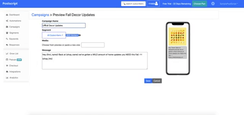

# React-Express Starter
This repo contains a barebones app using React 16 and Express using Webpack 4 and Babel 7. The react app currently renders a simple Hello World. It can easily be extended by adding more components and routes to make a full-stack app.



This project was built as a takehome for Postscript. You can find the [full video demo here](https://youtu.be/xzozi9hcN_A).

## Getting Started

### Installation

**You’ll need to have Node >= 6 on your machine**. You can use [nvm](https://github.com/creationix/nvm#installation) to easily switch Node versions between different projects.

```sh
npm install
```

```sh
npm run react-dev
npm start
```

Then open [http://localhost:3000/](http://localhost:3000/) to see your app.<br>
# react-express-starter


### Reflection
Improvements to the service:
- Create more appealing confirmation layouts rather than using native browser
- A hover-over on the TableEntry creates a sneak peak of the CampaignPreview phone view
- Allow for additional options for each TableEntry, such as duplicating a campaign
- Incorporate a gif/img-market so that users don't have to manually link every gif/img
